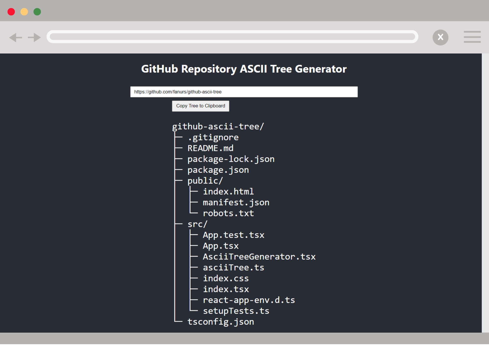

# GitHub ASCII Tree Generator (with raw links)

GitHub ASCII Tree Generator is a React app that generates ASCII trees for GitHub repositories. Simply copy and paste the repository URL and visualize the structure in seconds. 

